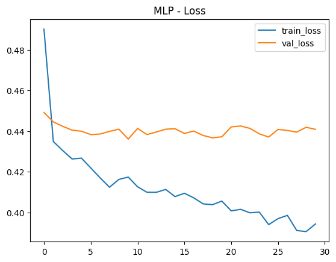
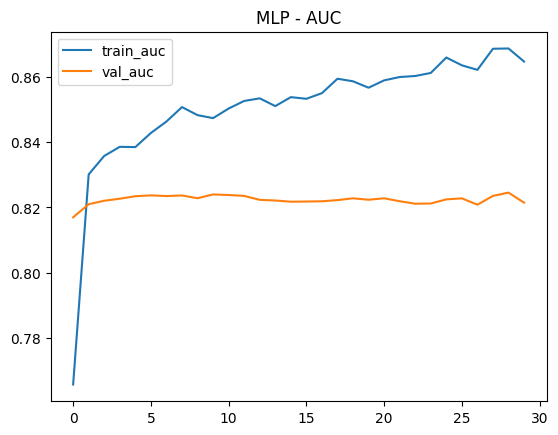
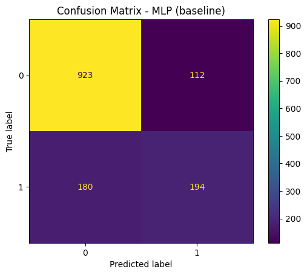
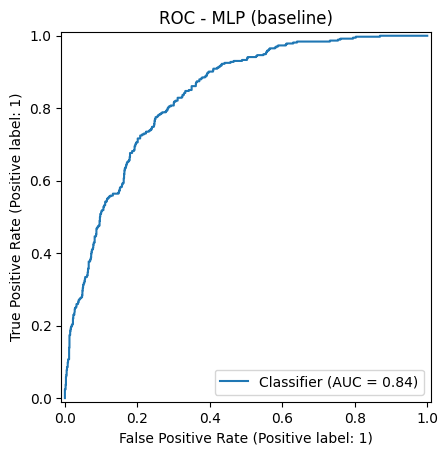
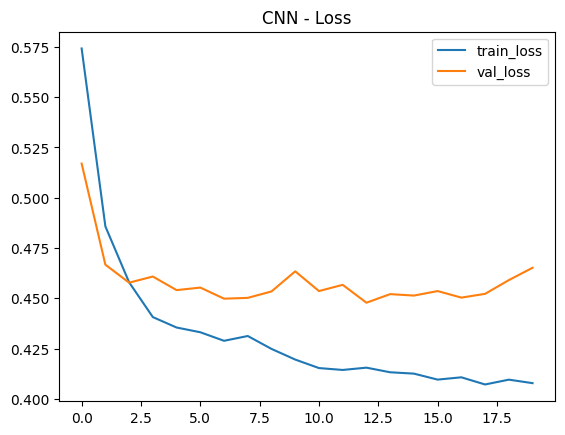
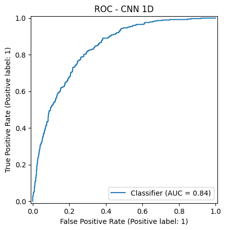
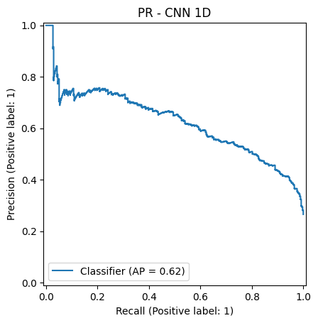

# Actividad 4 – ML2: Redes Neuronales para Predicción de Churn (Telco)

Repositorio correspondiente a la **Actividad 4 de Machine Learning II**, donde se implementan y comparan modelos de **Deep Learning (MLP y CNN 1D)** sobre el dataset **Telco Churn**, manteniendo el esquema base de preprocesamiento (imputación, one-hot encoding y escalamiento).

---

## 🎯 Objetivo

Predecir la probabilidad de que un cliente realice **Churn** (abandono del servicio), formulado como un problema de **clasificación binaria desbalanceada**, evaluando el aporte de redes neuronales frente a modelos clásicos desde una perspectiva **técnica y de negocio**.

---

## 📦 Dataset

- **Fuente:** `data/data-churn.csv`
- **Observaciones:** ~7.043 clientes
- **Variable objetivo:** `Churn` (Yes / No → 1 / 0)
- **Proporción clase positiva (churn):** ~26.5%

Cada fila representa un cliente con variables demográficas, contractuales, de servicios y facturación.

---

## ⚙️ Preprocesamiento (esquema base solicitado)

Se mantuvo el esquema estándar solicitado en el curso para asegurar comparabilidad:

- **Variables numéricas**
  - Imputación por mediana
  - Escalamiento con `StandardScaler`

- **Variables categóricas**
  - Imputación por moda
  - One-Hot Encoding con `handle_unknown="ignore"`

- **Split:** Train/Test estratificado (80/20)
- **Métrica principal:** **F1-score sobre la clase positiva (churn = 1)**

---

# ✅ Paso 1 — MLP (Perceptrón Multi-Capa)

## Arquitectura del modelo

- Capa densa: `Dense(64, ReLU)` + Dropout
- Capa densa: `Dense(32, ReLU)` + Dropout
- Capa de salida: `Dense(1, Sigmoid)`

**Función de pérdida:** Binary Crossentropy  
**Optimizador:** Adam  

Esta arquitectura balancea **capacidad de representación** y **riesgo de sobreajuste** para un dataset tabular de tamaño medio.

---

## 📈 Curvas de entrenamiento — MLP

### Loss


### AUC


**Observación:**  
La pérdida de entrenamiento disminuye consistentemente, mientras que la validación se estabiliza, indicando convergencia con leve sobreajuste controlado.

---

## 📊 Resultados en Test — MLP

- **Accuracy:** 0.7807  
- **Precision:** 0.5910  
- **Recall:** 0.5642  
- **F1:** 0.5773  
- **ROC-AUC:** 0.8366  
- **PR-AUC:** 0.6345  

### Matriz de Confusión


### Curva ROC


### Curva Precision–Recall


**Interpretación:**  
El modelo logra un equilibrio razonable entre precision y recall, adecuado para escenarios de retención donde es preferible capturar churn reales.

---

# ✅ Paso 2 — Experimentos: Learning Rate y Batch Size

Se analizaron los efectos de:

- **Learning Rate:** estabilidad de la convergencia
- **Batch Size (16 / 32 / 64):** velocidad de entrenamiento vs generalización

**Conclusión:**  
Learning rates pequeños favorecen estabilidad, mientras que batch sizes intermedios (32) logran un buen compromiso entre tiempo y desempeño.

---

# ✅ Paso 3 — Red Neuronal Convolucional (CNN 1D)

## Justificación

Aunque el churn es un problema tabular, se reinterpretan las features como una **señal 1D**, permitiendo a la CNN detectar **patrones locales entre grupos de variables** mediante filtros convolucionales.

---

## Arquitectura CNN 1D

- Conv1D + MaxPooling
- Conv1D + GlobalMaxPooling
- Capa densa final + Sigmoid

---

## 📈 Curvas de entrenamiento — CNN

### Loss


---

## 📊 Resultados en Test — CNN 1D

- **Accuracy:** 0.7956  
- **Precision:** 0.6453  
- **Recall:** 0.5107  
- **F1:** 0.5701  
- **ROC-AUC:** 0.8387  
- **PR-AUC:** 0.6323  

### Matriz de Confusión


### Curva ROC


### Curva Precision–Recall


**Interpretación:**  
La CNN mejora la precision pero reduce el recall, lo que puede ser menos conveniente en estrategias de retención donde el costo de no detectar churn es alto.

---

# ✅ Paso 4 — Comparación final y análisis crítico

| Modelo | Accuracy | Precision | Recall | F1 | ROC-AUC | PR-AUC |
|------|---------:|----------:|-------:|---:|--------:|-------:|
| MLP | 0.7807 | 0.5910 | 0.5642 | **0.5773** | 0.8366 | **0.6345** |
| CNN 1D | 0.7956 | **0.6453** | 0.5107 | 0.5701 | **0.8387** | 0.6323 |

---

## 🧠 Análisis desde la perspectiva de negocio

- El **MLP ofrece mejor balance Recall/F1**, clave para retención de clientes.
- La **CNN no aporta una mejora significativa** frente a su mayor complejidad.
- En datasets tabulares medianos, **modelos clásicos o MLP simples son suficientes**.
- Las redes neuronales aportan ventajas claras solo con:
  - Mayor volumen de datos
  - Estructura temporal o espacial
  - Interacciones no lineales complejas

---

## ⚠️ Riesgos de sobreajuste

- Arquitecturas profundas con pocos datos
- Exceso de parámetros sin regularización
- Optimización basada solo en accuracy

Se mitiga mediante Dropout, validación y métricas orientadas a la clase minoritaria.

---

## 🧾 Reproducibilidad

Instalación de dependencias:

```bash
pip install -r requirements.txt
